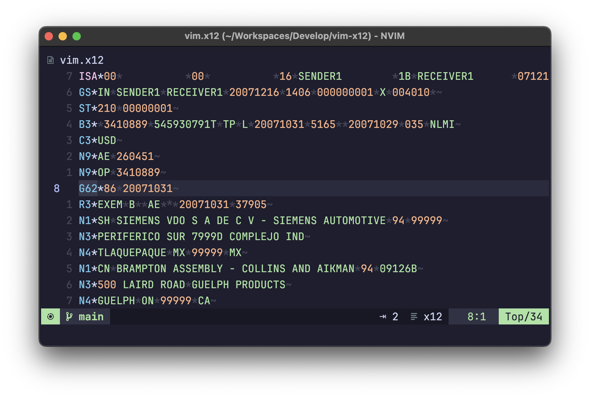

# vim-x12

A very simple [X12 EDI][x12-edi] syntax highlighting plugin for Vim.

Reading X12 EDI documents give you headaches? Adding syntax highlighting makes a pretty big difference when you are trying to parse the contents of a one-thousand-line EDI 210.

This syntax plugin is incredibly simple, and built around the documents that I read on a regular basis in the transportation industry.
It isn't perfect, but I have found that it helps make larger documents easier to read.

## Example

Highlighting features:

- Emphasized segment identifiers (including special coloring for ISA and IEA segments).
- Reduced visibilty of segment and element delimiters.
- Different colors for alphanumeric and numeric elements.
- Broken highlighting for the first element delimiter after a segment identifier (issue #1) - please help!

## Contributing

Find a problem? See something that could be improved? Please open an issue! Any and all contributions are welcome.

<!-- Reference -->

[x12-edi]: https://www.stedi.com/edi
